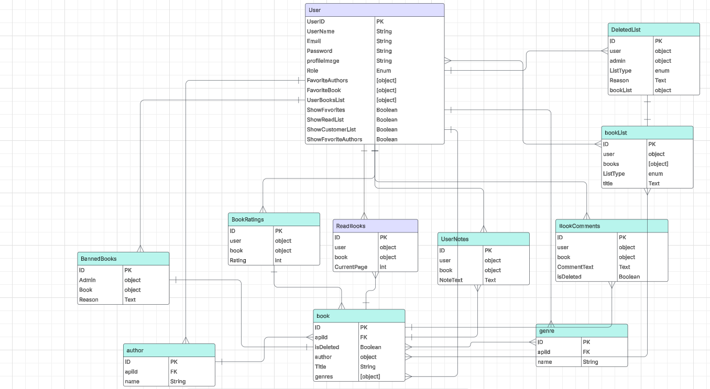
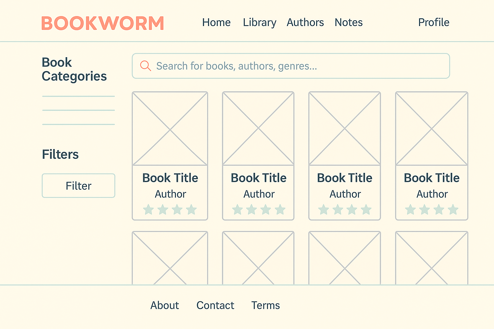
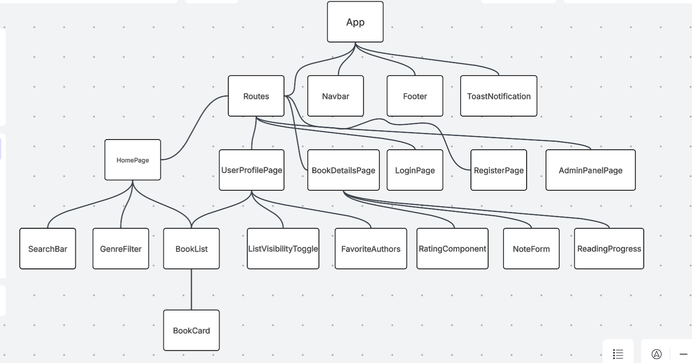

# �� Book Tracking Web App

A full-stack MERN (MongoDB, Express, React, Node.js) application for tracking, rating, and organizing books fetched from an external API. Designed with user personalization and admin moderation in mind.

---

---

---

## �� Features

### �� Public Users

- Browse book list from an external API
- View book details (title, author, year, genres, description)
- Search and filter books by title or genre
- Register/Login to save preferences

### �� Registered Users

- Add books to:
  - Favorites List
  - Read List (with page progress if book is a PDF)
  - Custom Lists
- Add favorite authors
- Rate books (1–5 stars) and view average ratings
- Write private notes on books
- Show/hide book lists in profile
- Track reading goals (monthly/yearly)
- View activity history
- View recently added books
- Receive toast notifications for actions

### ��️ Admin Features

- Role-based access for admin
- Delete or hide inappropriate comments
- Remove/reset user book lists
- Ban or hide specific books
- Log admin actions (e.g. reason for banning)

---

## �� Tech Stack

- **Frontend**: React, React Router, Context API or Redux, TailwindCSS / Bootstrap
- **Backend**: Node.js, Express.js
- **Database**: MongoDB with Mongoose ODM
- **Auth**: JWT + bcrypt
- **File Uploads**: Multer (for profile pictures)
- **External API**: Google Books API or similar

---
=======
# Book

## 02/06/2025

### By: Sayed Hussain, Maryam Ali, Noor Faisal

---

#### [GitHub Repository]

---

### _Project Description_

#### This book application allows users to browse and search books from an external API, view detailed info and filter by genre. Also, registered users will be able to create their own costume booklists, favorite author, track reading progress, add private notes and ratings ,and set reading goals. Admins can manage user content and edit books and comments.

---

### _Technologies Used_

- React By Vite
- CSS
- JSX

### _Diagram_

![ERD Diagrams] (image.png)

## Features

- Filter books by genre
- Register and log in to access personal features
- Personal Book List
- Responsive UI for seamless interaction
- Show/hide specific lists
- Upload/change profile picture
- Rate books
- Reading Progress
- Private Notes
- Admin Features
